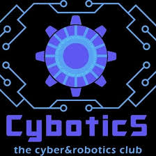

# CYBOTICS Gravity Shift

<p align="center">
  
</p>

<p align="center">
  <strong>A fast-paced gravity-control game developed for the CYBOTICS IT Club.</strong>
</p>

<p align="center">
  Python 3.12 | Pygame 2.6 | SQLite | JSON | PyInstaller
</p>

---

## About the Project

**CYBOTICS Gravity Shift** is a gravity-based arcade and puzzle game developed for the **CYBOTICS IT Club**.

Instead of controlling the player with traditional movement controls, the player changes the direction of gravity.

The objective is simple:

> Change gravity, navigate the chamber, avoid hazards, and reach the CORE.

The game contains a complete **20-level campaign** that progressively introduces new mechanics, tighter navigation, moving hazards, momentum challenges, multiple routes, timing challenges, and increasingly complex gravity sequences.

The game was designed for CYBOTICS events and demonstrations, where a new player should be able to understand the main mechanic quickly while still having enough depth for competitive play.

---

## Main Features

- Complete 20-level campaign
- Four-direction gravity control
- Momentum-based movement
- Static hazards
- Moving hazards
- Multiple-route levels
- Precision challenges
- Timing challenges
- Speed challenges
- Gravity puzzles
- Progressive difficulty
- Local SQLite leaderboard
- Player-name validation
- Duplicate-name protection
- Score and time tracking
- Death penalties
- Run statistics
- High-score detection
- Top 10 leaderboard
- In-game leaderboard clearing
- Fullscreen support
- Persistent settings
- Separate music and sound-effect volume
- Global mute option
- Futuristic background music
- Custom generated sound effects
- Player movement particles
- Gravity-shift effects
- Collision sparks
- CORE effects
- Death explosion effects
- Screen shake
- Animated main menu
- Smooth level transitions
- Level introduction cards
- Standalone Windows build with PyInstaller

---

## Gameplay

The player is represented by a cybernetic block inside a chamber.

There is no traditional walking or jumping system.

Instead, the player changes gravity in one of four directions:

```text
             W / UP
                |
                |
A / LEFT -------+------- D / RIGHT
                |
                |
             S / DOWN
```

Changing gravity accelerates the player in the selected direction.

Momentum is preserved, which means changing gravity does not instantly stop the player's current movement.

The player must use this system to navigate platforms, avoid hazards, and reach the glowing CORE.

---

## Controls

| Key | Action |
|---|---|
| `W` | Gravity Up |
| `Up Arrow` | Gravity Up |
| `A` | Gravity Left |
| `Left Arrow` | Gravity Left |
| `S` | Gravity Down |
| `Down Arrow` | Gravity Down |
| `D` | Gravity Right |
| `Right Arrow` | Gravity Right |
| `R` | Restart current level |
| `Esc` | Pause / Back |
| `Enter` | Confirm / Continue |
| `F11` | Toggle fullscreen |
| `M` | Mute / unmute while paused |

---

## Objective

Every level contains a glowing target called the **CORE**.

The player must reach the CORE while navigating the level using gravity manipulation.

Completing a level records:

- Completion time
- Level score
- Completion bonus
- Time bonus

The player then proceeds to the next chamber.

The full run ends after completing Level 20.

---

## 20-Level Campaign

The campaign contains exactly 20 levels.

Each level introduces or combines different gameplay concepts.

| Level | Name | Main Concept |
|---:|---|---|
| 01 | Basic Gravity | Introduction to gravity switching |
| 02 | Direction | Switching between multiple directions |
| 03 | Vertical Navigation | Vertical movement and gravity reversal |
| 04 | Horizontal Navigation | Horizontal gravity control |
| 05 | Timing | Basic hazard timing |
| 06 | Narrow Paths | Controlled navigation |
| 07 | Gravity Traps | Dangerous gravity decisions |
| 08 | Multiple Routes | Safe and risky paths |
| 09 | Moving Hazard | Introduction to moving hazards |
| 10 | Complex Layout | Combination of previous mechanics |
| 11 | Precision | Tighter movement and passages |
| 12 | Multiple Hazards | Static and moving hazards |
| 13 | False Route | Route-selection challenge |
| 14 | Momentum | Advanced momentum control |
| 15 | Gravity Sequence | Planned gravity-switch sequence |
| 16 | Speed Challenge | Fast completion challenge |
| 17 | Risk Reward | Short dangerous route vs safer route |
| 18 | System Overload | Complex mechanic combination |
| 19 | Final Trial | Advanced mastery challenge |
| 20 | CORE | Final level and campaign conclusion |

---

## Scoring System

Gravity Shift includes a competitive scoring system.

Each level can award:

```text
LEVEL SCORE
=
COMPLETION BONUS
+
TIME BONUS
```

The time bonus depends on how quickly the player completes the level compared with its target time.

The game also tracks the total run score across all completed levels.

### Death Penalty

Deaths reduce the current run score by a configurable percentage.

The default death penalty is:

```text
2% of the current run score
```

### Run Bonuses

The system also supports:

- Full campaign completion bonus
- Perfect-run bonus
- Death penalties

The scoring configuration is centralized in:

```text
settings.py
```

---

## Run Statistics

During a complete run, the game tracks:

- Player name
- Current score
- Best score
- Current level
- Levels completed
- Level completion time
- Total run time
- Number of deaths
- Number of restarts
- Death penalties
- Final score
- Final leaderboard rank

---

## Leaderboard

The game includes a local leaderboard powered by **SQLite**.

The leaderboard records:

```text
Player Name
Score
Levels Completed
Total Time
Deaths
Restarts
Death Penalties
Run Completion Status
Timestamp
```

Leaderboard entries are primarily ranked by:

1. Highest score
2. Lowest completion time when necessary

The interface displays the **Top 10 players**.

A newly saved run can also display:

```text
NEW HIGH SCORE
```

and its leaderboard rank.

---

## Player Names

A player enters a name before beginning a run.

Player names are normalized and validated before the run starts.

The current system supports short names and prevents duplicate registered names.

The leaderboard can be cleared from inside the game, which also makes previously used player names available again.

---

## Clearing the Leaderboard

Open:

```text
MAIN MENU
→ LEADERBOARD
```

Then press:

```text
C
```

The game asks for confirmation.

Press:

```text
Y
```

to clear the leaderboard.

Press:

```text
N
```

or:

```text
Esc
```

to cancel.

---

## Audio System

Gravity Shift includes a custom audio system.

### Music

The game includes a futuristic electronic background track designed to remain present without distracting from gameplay.

### Sound Effects

The game includes sounds for:

- Menu navigation
- Menu selection
- Gravity switching
- Starting a run
- CORE completion
- Death
- Level transitions
- Run completion
- New high score

The current audio assets are generated specifically for the project.

---

## Audio Settings

Music and sound effects can be configured independently.

Available settings:

```text
MUSIC VOLUME
SOUND EFFECTS VOLUME
GLOBAL MUTE
```

The settings menu supports keyboard and mouse control.

### Keyboard

Use:

```text
UP / DOWN
```

to select an option.

Use:

```text
LEFT / RIGHT
```

to adjust volume.

Use:

```text
M
```

to mute or unmute the audio system.

---

## Fullscreen

Fullscreen mode is supported.

Press:

```text
F11
```

from anywhere in the application to switch between:

```text
WINDOWED
```

and:

```text
FULLSCREEN
```

Fullscreen mode can also be changed from the Settings menu.

---

## Persistent Settings

The game automatically saves user preferences.

Saved preferences include:

- Fullscreen mode
- Music volume
- Sound-effect volume
- Mute state

The preferences file is generated automatically:

```text
data/preferences.json
```

The game restores these settings the next time it starts.

---

## Visual Effects

Gravity Shift includes a dedicated visual-effects system.

### Player Effects

- Cyan movement trail
- Gravity-switch particles
- Directional gravity pulse
- Collision sparks
- Player glow

### CORE Effects

- Pulsing CORE
- Multiple glow layers
- Idle particles
- Completion burst
- Particles moving toward the CORE

### Death Effects

- Particle explosion
- Red screen flash
- Screen shake
- Failure overlay

### High Score Effects

A new high score triggers:

- Particle burst
- Cyan screen effect
- Screen border pulse
- Short screen shake
- Dedicated high-score sound

---

## Animated Interface

The user interface includes several animation systems.

### Main Menu

The main menu includes:

- Animated grid
- Pulsing digital nodes
- Floating CYBOTICS logo
- Logo glow
- Animated title
- Smooth button-selection animation
- Animated menu accents

### Level Transitions

Transitions between levels include:

- Fade out
- Level loading
- Fade in
- Level introduction card

Example:

```text
LEVEL 07
GRAVITY TRAPS

CYBOTICS // GRAVITY PROTOCOL
```

Transitions are intentionally short so gameplay remains fast.

---

## Technologies

The project uses the following technologies:

| Technology | Purpose |
|---|---|
| Python 3.12 | Main programming language |
| Pygame 2.6 | Game engine, graphics, input and audio |
| SQLite | Local leaderboard database |
| JSON | Data-driven level definitions |
| PyInstaller | Standalone Windows packaging |
| Git | Version control |
| GitHub | Source-code hosting |

The project does not require a large external game engine.

---

## Project Architecture

```text
cybotics_game/
│
├── assets/
│   │
│   ├── audio/
│   │   ├── cybotics_theme_v2.wav
│   │   ├── death_v2.wav
│   │   ├── goal_v2.wav
│   │   ├── gravity_v2.wav
│   │   ├── high_score_v2.wav
│   │   ├── level_transition_v2.wav
│   │   ├── menu_click_v2.wav
│   │   ├── menu_move_v2.wav
│   │   ├── run_complete_v2.wav
│   │   └── run_start_v2.wav
│   │
│   └── images/
│       └── cybotics_logo.jpg
│
├── data/
│   ├── leaderboard.db
│   └── preferences.json
│
├── entities/
│   ├── __init__.py
│   └── moving_hazard.py
│
├── game/
│   ├── __init__.py
│   ├── audio.py
│   ├── effects.py
│   ├── leaderboard.py
│   ├── level.py
│   ├── player.py
│   ├── preferences.py
│   └── scoring.py
│
├── levels/
│   ├── level_01.json
│   ├── level_02.json
│   ├── level_03.json
│   ├── level_04.json
│   ├── level_05.json
│   ├── level_06.json
│   ├── level_07.json
│   ├── level_08.json
│   ├── level_09.json
│   ├── level_10.json
│   ├── level_11.json
│   ├── level_12.json
│   ├── level_13.json
│   ├── level_14.json
│   ├── level_15.json
│   ├── level_16.json
│   ├── level_17.json
│   ├── level_18.json
│   ├── level_19.json
│   └── level_20.json
│
├── ui/
│   ├── __init__.py
│   ├── leaderboard.py
│   ├── menu.py
│   ├── name_entry.py
│   ├── settings_screen.py
│   └── transitions.py
│
├── .gitignore
├── main.py
├── settings.py
└── README.md
```

Runtime files such as `leaderboard.db` and `preferences.json` are generated locally and are not committed to the repository.

---

## Level System

Levels are data-driven.

Each level is stored as an individual JSON file inside:

```text
levels/
```

A level can define:

- Level number
- Level name
- Target time
- Completion bonus
- Time multiplier
- Player starting position
- CORE position
- Platforms
- Static hazards
- Moving hazards

This keeps level design separate from the main Python gameplay code.

---

## Example Level Data

A level follows a structure similar to:

```json
{
  "level": 1,
  "name": "Basic Gravity",
  "target_time": 14.0,
  "completion_bonus": 500,
  "time_multiplier": 100,
  "player_start": [150, 550],
  "goal": [1060, 555, 46, 46],
  "platforms": [
    [470, 350, 24, 276],
    [470, 326, 280, 24]
  ],
  "hazards": []
}
```

---

## Running the Game from Source

### 1. Clone the Repository

```bash
git clone https://github.com/hicham-4r/cybotics_game.git
```

### 2. Enter the Project

```bash
cd cybotics_game
```

### 3. Create a Virtual Environment

Windows:

```bash
python -m venv .venv
```

### 4. Activate the Environment

PowerShell:

```powershell
.\.venv\Scripts\Activate.ps1
```

Command Prompt:

```cmd
.venv\Scripts\activate
```

### 5. Install Pygame

```bash
python -m pip install pygame
```

### 6. Start the Game

```bash
python main.py
```

---

## Recommended Python Version

The project was developed and tested using:

```text
Python 3.12
```

and:

```text
Pygame 2.6.1
```

---

## Building the Windows Version

The project can be converted into a standalone Windows application using PyInstaller.

Install PyInstaller:

```powershell
python -m pip install pyinstaller
```

Build the project:

```powershell
python -m PyInstaller --noconfirm --clean --onedir --windowed --contents-directory . --name "CYBOTICS_Gravity_Shift" --add-data "assets:assets" --add-data "levels:levels" main.py
```

After the build completes, the packaged application is located in:

```text
dist/CYBOTICS_Gravity_Shift/
```

Run:

```text
CYBOTICS_Gravity_Shift.exe
```

The standalone build does not require Python or PyCharm to be installed on the target Windows computer.

---

## Why One-Folder Packaging Is Used

The Windows version uses PyInstaller's one-folder mode.

This allows the game to keep writable local files such as:

```text
data/leaderboard.db
data/preferences.json
```

alongside the application.

It also makes the game easier to inspect and maintain during CYBOTICS events.

---

## Creating the Distribution ZIP

After creating the Windows build, the complete folder can be compressed for distribution.

Example PowerShell command:

```powershell
Compress-Archive -Path ".\dist\CYBOTICS_Gravity_Shift" -DestinationPath ".\CYBOTICS_GRAVITY_SHIFT_FINAL.zip" -Force
```

The ZIP can then be transferred to another Windows PC.

Extract it and launch:

```text
CYBOTICS_Gravity_Shift.exe
```

---

## Files Excluded from Git

Development and runtime files are excluded using `.gitignore`.

Examples include:

```text
.venv/
.idea/
.vscode/

__pycache__/

build/
dist/

*.spec

data/*.db
data/preferences.json

*.zip
*.rar
*.7z
```

This keeps the repository focused on the source code and required assets.

---

## Database

The leaderboard database is created automatically when the game is launched.

Database location:

```text
data/leaderboard.db
```

SQLite is part of the Python standard library, so no separate database server is required.

No internet connection is required for the leaderboard.

---

## Offline Operation

Gravity Shift is designed to work completely offline.

The game does not require:

- An online account
- A remote database
- An external API
- An internet connection
- A web server

This makes it suitable for club fairs, demonstrations, classrooms, and local competitions.

---

## CYBOTICS Event Use

The project was designed with public CYBOTICS events in mind.

A typical setup is:

```text
Windows PC
    |
    +-- CYBOTICS Gravity Shift
    |
    +-- Keyboard
    |
    +-- Game Display
```

Players can:

```text
Enter Name
    ↓
Start Run
    ↓
Complete Levels
    ↓
Earn Score
    ↓
Finish or End Run
    ↓
View Leaderboard
```

The next player can then immediately begin another run.

---

## Development Status

The main development of the game is complete.

| System | Status |
|---|---|
| Core gravity mechanic | Complete |
| Player physics | Complete |
| Collision system | Complete |
| 20-level campaign | Complete |
| Static hazards | Complete |
| Moving hazards | Complete |
| Score system | Complete |
| Death penalties | Complete |
| Run statistics | Complete |
| Player-name system | Complete |
| SQLite leaderboard | Complete |
| Top 10 ranking | Complete |
| Leaderboard clearing | Complete |
| Fullscreen | Complete |
| Persistent settings | Complete |
| Music | Complete |
| Sound effects | Complete |
| Music volume | Complete |
| SFX volume | Complete |
| Particle system | Complete |
| Screen shake | Complete |
| CORE effects | Complete |
| Death effects | Complete |
| Animated menu | Complete |
| Level transitions | Complete |
| Windows packaging | Complete |
| Gameplay testing | Complete |

---

## Development and Testing

The game has been tested as both:

```text
Python source
```

and:

```text
Standalone Windows application
```

Gameplay testing included external playtesting to verify that:

- The game starts correctly
- Gravity controls work
- Levels are playable
- Hazards work correctly
- Scoring works
- Audio works
- Fullscreen works
- Settings persist
- The leaderboard works
- The packaged Windows version launches correctly

---

## Project Goals

The main goals of Gravity Shift were to create a game that is:

- Easy to understand
- Fast to start
- Difficult to master
- Competitive
- Visually recognizable
- Suitable for public demonstrations
- Playable offline
- Lightweight
- Easy to deploy on Windows
- Representative of the technical work of CYBOTICS

---

## CYBOTICS

**CYBOTICS Gravity Shift** is a CYBOTICS IT Club project.

The project combines programming, game logic, physics, user-interface design, database management, audio processing, data-driven level design, software packaging, and interactive system development.

---

## Programming Lead

**Hicham**

Programming Lead — CYBOTICS IT Club

GitHub: [@hicham-4r](https://github.com/hicham-4r)

As Programming Lead, the role includes contributing to the technical development and programming direction of CYBOTICS projects and activities.

---

## Repository

Source code:

[github.com/hicham-4r/cybotics_game](https://github.com/hicham-4r/cybotics_game)

---

## Contributing

This repository represents the CYBOTICS Gravity Shift project.

For development work:

1. Create a branch for your changes.
2. Test the game locally.
3. Verify that all affected levels still work.
4. Do not commit local leaderboard data.
5. Do not commit virtual environments or build directories.
6. Keep level-specific data inside the `levels/` directory when possible.
7. Keep reusable game systems inside the appropriate `game/`, `entities/`, or `ui/` module.

---

## Notes

The local leaderboard and user preferences are intentionally not stored in Git.

Each installation can therefore maintain its own:

```text
Leaderboard
Settings
Player Data
```

without affecting the source repository.

---

## Acknowledgements

This project was created for the **CYBOTICS IT Club** and its activities.

Special thanks to everyone who participated in testing and provided feedback during development.

---

## Project Information

```text
Project:       CYBOTICS Gravity Shift
Organization:  CYBOTICS IT Club
Category:      Gravity Puzzle / Arcade Game
Platform:      Windows
Language:      Python
Framework:     Pygame
Database:      SQLite
Level Format:  JSON
Packaging:     PyInstaller
Levels:        20
Game Mode:     Single Player
Leaderboard:   Local
Programming Lead: Hicham
```

---

<p align="center">
  <strong>CYBOTICS — GRAVITY SHIFT</strong>
</p>

<p align="center">
  Change Gravity. Reach the CORE.
</p>
